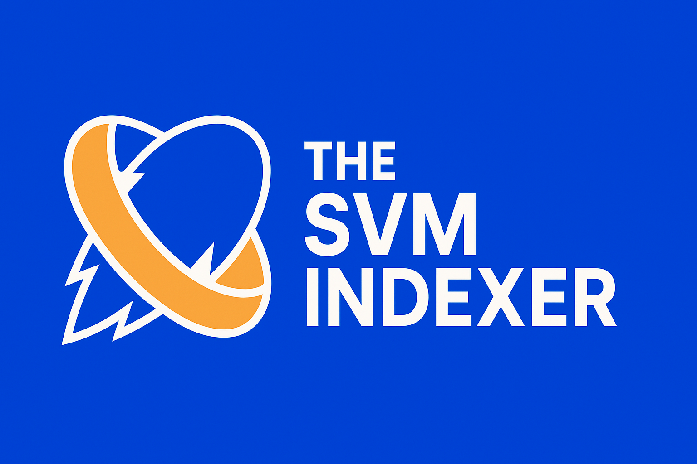

# Sonic SVM Blockchain Dashboard

This project is a web-based dashboard focused on providing data analytics, enhancing transparency, and enabling real-time monitoring for the **Sonic SVM** blockchain ecosystem. Built to address the need for comprehensive data tools in emerging SVM environments, this dashboard aims to empower developers, users, and stakeholders with actionable insights into on-chain assets and projects within the Sonic network.

## Features

*   **Dashboard Overview:** Presents key metrics and information about the Sonic SVM ecosystem through a tabbed interface.
*   **Sonic Transaction Monitoring:**
    *   Displays a list of recent or relevant transactions occurring on the Sonic SVM chain.
    *   Provides a detailed view for individual Sonic transactions (accessed via transaction hash).
*   **Sonic Wallet Overview:** Shows a summary of wallet balances, assets, or other relevant data specific to wallets on the Sonic network.
*   **Sonic Program Analytics:** Offers analytics and insights into the performance or usage of specific programs (smart contracts) deployed on Sonic SVM.
*   **Leaderboards:** Tracks and displays rankings based on metrics relevant to the Sonic ecosystem (e.g., transaction volume, specific program interactions).

## Tech Stack

*   **Framework:** Next.js (React)
*   **Styling:** Tailwind CSS
*   **UI Components:** shadcn/ui (built on Radix UI & Tailwind)
*   **Charting:** Recharts
*   **Forms & Validation:** React Hook Form, Zod
*   **Language:** TypeScript
